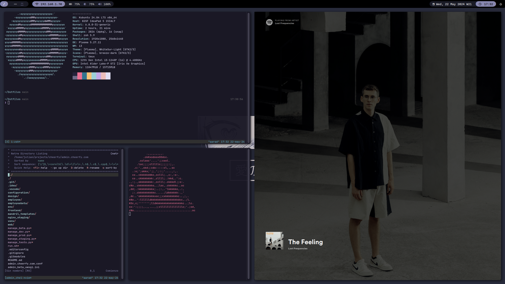

personal dotfiles :)

the general theme is rose-pine

some commands wont work outside of kubuntu, trying to getting out of here aaa.

## Dependencies:
* [zsh](https://www.zsh.org/)
* [ohmyzsh](https://github.com/ohmyzsh/ohmyzsh)
* [eza](https://github.com/eza-community/eza)
* [bat](https://github.com/sharkdp/bat)
* [fzf from source](https://github.com/junegunn/fzf)
* [fzf-tab](https://github.com/Aloxaf/fzf-tab?tab=readme-ov-file#manual)
* [alacritty](https://github.com/alacritty/alacritty)
* [neovim from source](https://github.com/neovim/neovim)
* [ripgrep](https://github.com/BurntSushi/ripgrep)
* [polybar](https://github.com/polybar/polybar)
* [rofi](https://github.com/davatorium/rofi)
* [i3](https://github.com/i3/i3)
* [picom](https://github.com/yshui/picom)
* [feh](https://github.com/derf/feh)
* [redshift](https://github.com/jonls/redshift)
* [MartianMono Nerd Font](https://www.nerdfonts.com/font-downloads)
* [Noto Sans JP Font](https://fonts.google.com/noto/specimen/Noto+Sans+JP)

## Installation
i recomend using [gnu stow](https://www.gnu.org/software/stow/) for an easier installation.

after you have downloaded all the dependencies required just do:

```sh
git clone --recurse-submodules -j8 https://github.com/Jugacu/Dotfiles.git ~/Dotfiles
```
```sh
cd ~/Dotfiles && stow .
```

## Preview

